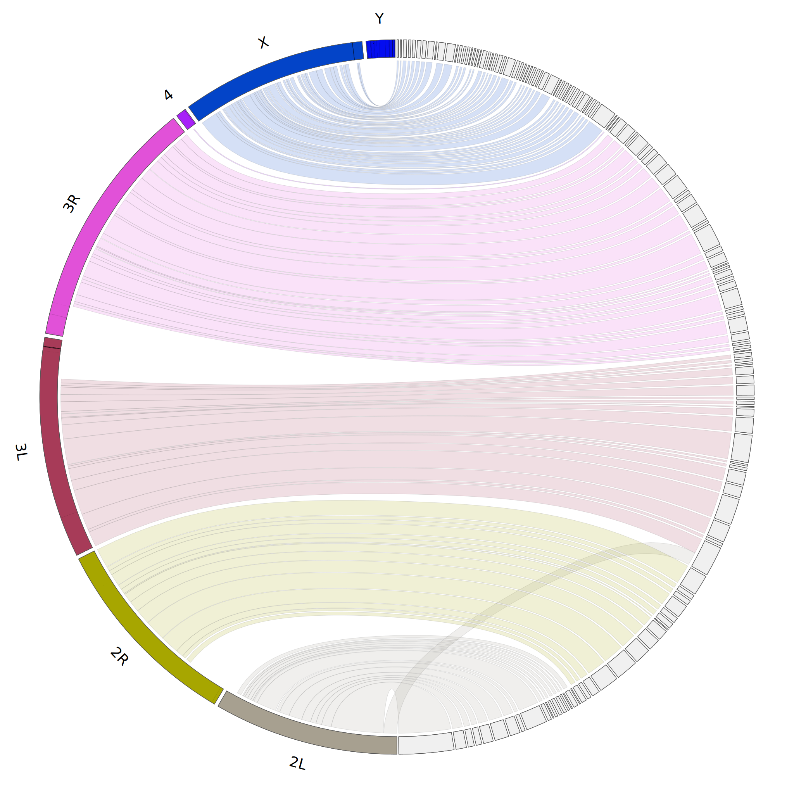

Circos Assembly Consistency (Jupiter) plot
======================
[](https://zenodo.org/badge/latestdoi/83077852)

This is a pipeline for generating a Circos based genome assembly consistency plot given a set of contigs relative to reference genome. Intended to visualize large scale translocations or missassemblies in draft assemblies, but it can also be useful when trying to show synteny between whole genomes.

Generates plots similar to those found in the [ABySS 2](http://genome.cshlp.org/content/27/5/768) and [Tigmint](https://bmcbioinformatics.biomedcentral.com/articles/10.1186/s12859-018-2425-6) papers, given only a reference genome fasta file and an assembly scaffolds fasta file. Good for getting a quick qualitative view of the missassemblies in a genome assembly.
Nicknamed after the type of plot you get if your assembly is relatively error free (looks like the planet Jupiter). If you think of features or some useful auxiliary information (e.g. for tracing back where a translocation event occurred) that the plot uses that I could report better let me know. 



Example plot on a Drosophila assembly showing a misassembly (or possible chromosomal fusion event) between L2 and L3. This event is inverted relative to the orientation show in the plot so the link is displayed as twisted. There are also smaller events internal to 3R. Note that by default only large scale events (>10kb) can be see in this plot, and small misassemblies, possibly medidated by repeats, cannot be seen (unless `maxBundleSize` is changed). The black lines on the reference indicate gaps of Ns, which can explain why some regions of the assembly are not covered (often found in telomeric or centromeric regions). Default settings except for ng=80 used.

### Requirements (for full pipeline):
* [Circos and Circos tools](http://circos.ca/software/download/circos/) (Installation Options below)
* [minimap2](https://github.com/lh3/minimap2) (currently included in repo, feel free to remove it)
* [samtools](https://github.com/samtools/samtools) (assumes that this is in the path of the user)
* GNU make

### Installing Circos
Circos can be installed with [linuxbrew](https://docs.brew.sh/Homebrew-on-Linux) using the command:
```{bash}
brew install circos
```

Perl Modules Needed (If downloading and installing Circos without a package manager):
* Config::General.pm
* Math::VecStat
* Set::IntSpan
* List::MoreUtils
* Modules needed for Circos: [http://www.circos.ca/documentation/tutorials/configuration/perl_and_modules/](http://www.circos.ca/documentation/tutorials/configuration/perl_and_modules/)

### Starting inputs:

* Set of scaffolds in fasta format
* Reference genome in fasta format

To generate a plot given these inputs, samtools and minimap2 must be in your path.

### Usage:

Simply run:
```{bash}
jupiter name=$prefix ref=$reference fa=$scaffolds
```

Optional commands:
```
sam=                #Specify an existing alignment of scafftigs to if they already exist (naming convention that fatoagp.pl produces must be consistent)
ng=75               #use largest scaffolds that are equal to 75% of the genome 
maxGap=100000       #maximum alignment gap allowed to consider a region contiguous
minBundleSize=50000 #minimum size of a contiguous region to render
m=100000            #only use genomic reference chromosomes larger than this value
i=0                 #increment for colouring chromosomes (HSV colour shift by setting 0-360), when set to >360 it generates random colours
t=4                 #number of threads to use for minimap2
g=1                 #minimum gap size in reference to render
gScaff=100000		#minimum gap size in scaffolds to render
```

If everything runs smoothly it will generate the following files:
```
prefix_scaffolds.fa (symlink)
prefix_reference.karyotype
prefix_reference.fa.sa
prefix_reference.fa.pac
prefix_reference.fa.ann
prefix_reference.fa.amb
prefix_reference.fa (symlink)
prefix.seqOrder.txt
prefix.svg
prefix-agp.sam
prefix.links
prefix.karyotype
prefix-agp.fa
prefix.conf
prefix.agp
```

Most likely, you will want to work with the svg file as the perl image processing module Circos uses has difficulty rendering transparency on png files.

### Relating image back to assembly:
`prefix.seqOrder.txt` file:
This file helps to relate the mapping order of each scaffold rendered back to the reference chromosomes in the plot. It lists what scaffold is rendered in the order to each reference chromosome from top of the plot to the bottom.

Here is the format:
```
internalRefID	refID	internalScaffoldID	scaffoldID strand
```

For example:
```
ref5	X	scaf109	361740	-
ref5	X	scaf120	361915	+
ref5	X	scaf68	361536	+
...
```

Chromosome X matches scaffold 361740 as the first segment (in the - direction relative to the orignal sequence) then scaffold 361915 (in the + direction relative to the orignal sequence) occurs as the next alignment (ordered in the 5'->3' direction relative to the reference). 

### Tips and Tricks:
 1. Renaming Chromosomes
You can relabel chromosomes by running to the `prefix.karyotype` stage, editing the file and run the rest of the pipeline:

```{bash}
#Run pipeline to prefix.karyotype stage
jupiter name=prefix $OPTS prefix.karyotype
#Edit the file prefix.karyotype file in some way
sed -i 's/chromosome/chr/g' prefix.karyotype
#Finish pipeline
jupiter name=prefix $OPTS
```

In this example, if the labels had `chromosome1` and they were then changed to `chr1`.

### Possible issues:
 1. Error regarding too many ideograms - Example:
```
You have asked to draw [831] ideograms, but the maximum is currently set at
  [500]. To increase this number change max_ideograms in etc/housekeeping.conf.
  Keep in mind that drawing that many ideograms may create an image that is too
  busy and uninterpretable.
```
This basically means the assembly may be too fragmented. You can decrease `ng` to smaller value or alter the housekeeping.conf to allow for more scaffolds to render (keeping in mind it may become quite unwieldy).

### Acknowledgements
* Members of the [BTL lab](http://www.birollab.ca/) at the [BCGSC](https://github.com/bcgsc) for testing and feedback.
* [ckeeling](https://github.com/ckeeling) for helping with identifying required perl modules.
* [harish0201](https://github.com/harish0201) for helping with adding minimap2 functionality.
